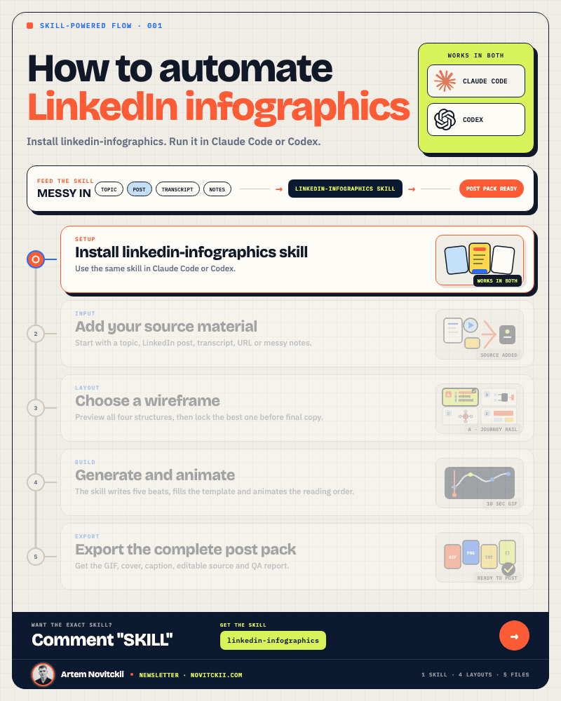
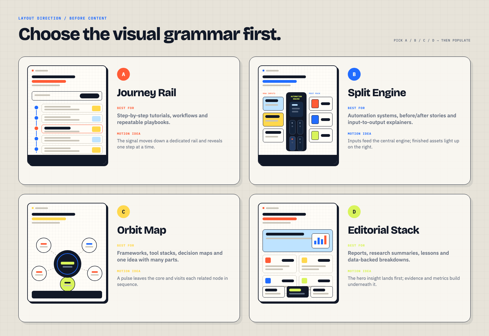
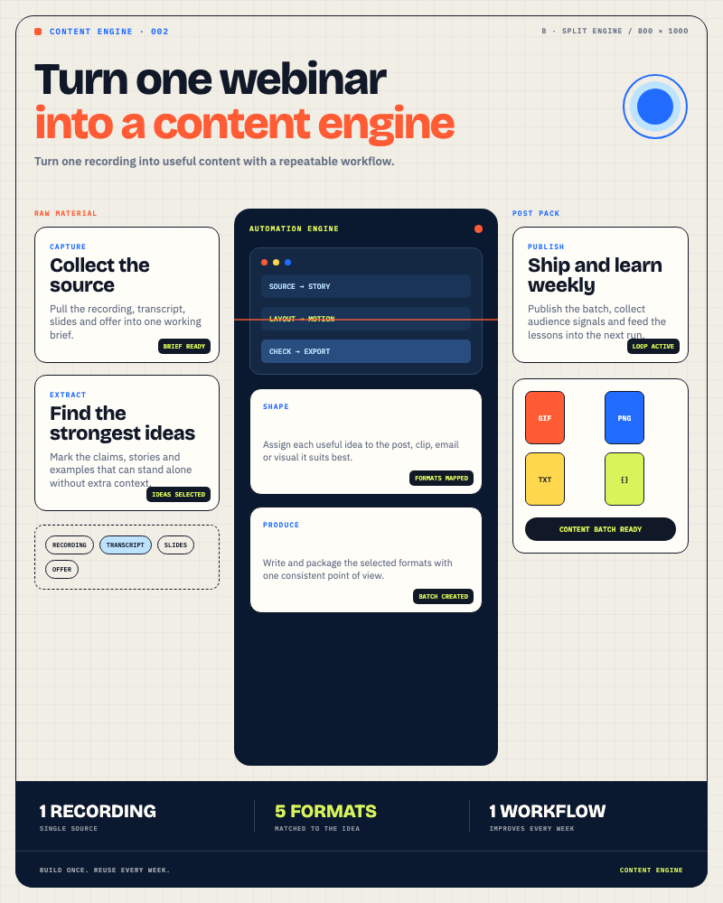
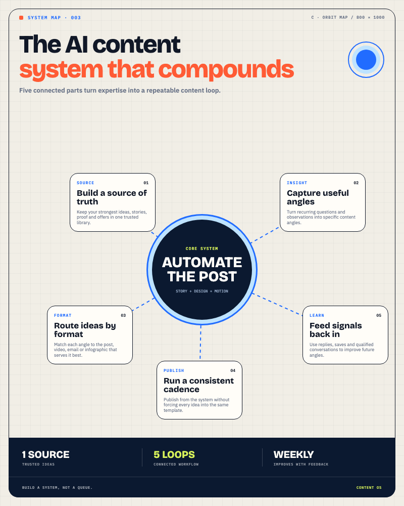
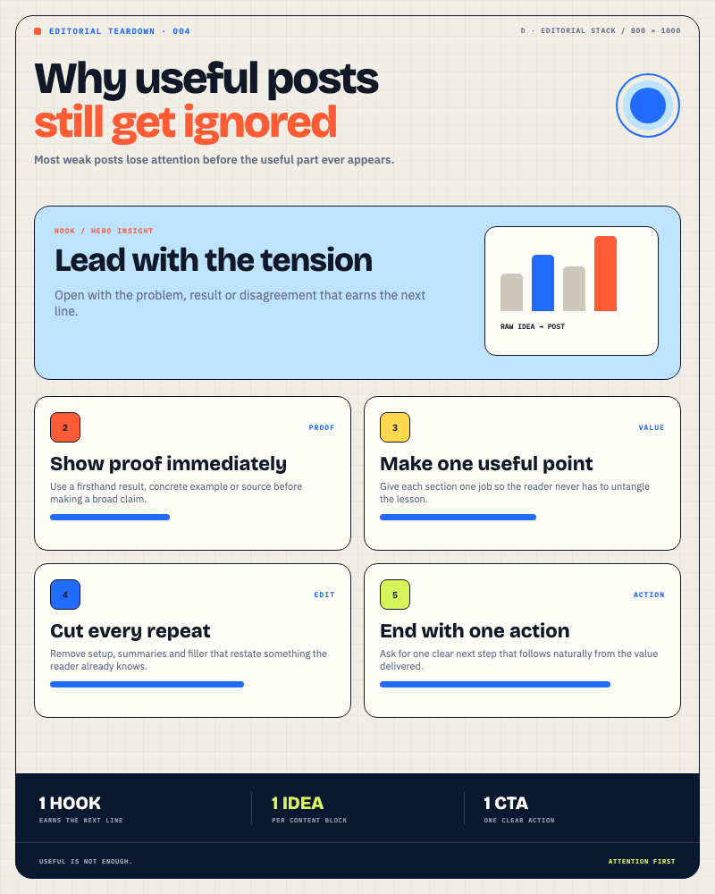

<p align="center">
  
</p>

<h1 align="center">LinkedIn Infographics</h1>

<p align="center">
  <strong>Turn a topic, post, transcript, URL, or rough notes into a publish-ready animated LinkedIn infographic.</strong>
</p>

<p align="center">Works as a reusable skill in <strong>Codex</strong> and <strong>Claude Code</strong>.</p>

## What it does

`linkedin-infographics` combines flexible editorial judgment with a deterministic Remotion renderer. The agent shapes the story and helps you choose a layout; the renderer handles typography, animation, export, and quality checks.

- Shows four low-fidelity wireframes before writing final copy.
- Distills the source into exactly five useful beats.
- Generates an 800 × 1000 infinitely looping GIF.
- Creates a static cover and a companion LinkedIn caption.
- Exports the editable JSON source and a machine-readable QA report.
- Supports an optional author portrait, name, and public plug.
- Keeps body copy and layout constraints schema-validated.

No image model is responsible for rendering the text. The final asset is produced from code, so the typography stays readable and repeatable.

## Choose the structure first



| Layout | Best for |
| --- | --- |
| **A · Journey Rail** | Tutorials, workflows, checklists, and ordered processes |
| **B · Split Engine** | Inputs → transformation → outputs and automation systems |
| **C · Orbit Map** | Frameworks, tool stacks, ecosystems, and central ideas |
| **D · Editorial Stack** | Research, lessons, reports, and evidence-led breakdowns |

The skill presents these options and waits for your choice before it writes final copy or renders the asset.

## Output bundle

Every render produces five files:

```text
<slug>.gif           Animated LinkedIn asset
<slug>.cover.png     Static cover and preview
<slug>.content.json  Editable source of truth
<slug>.caption.md    Companion LinkedIn post
<slug>.report.json   Dimensions, duration, size, and publish checks
```

The demo above is 800 × 1000, loops infinitely, runs for 10 seconds, and weighs 0.41 MB.

## Requirements

- Node.js 20 or newer
- npm
- `ffmpeg` and `ffprobe`
- Codex or Claude Code for the guided skill workflow

On macOS, install FFmpeg with:

```bash
brew install ffmpeg
```

## Install for Codex

```bash
git clone https://github.com/artemnovitckii/linkedin-infographics.git
cd linkedin-infographics
mkdir -p ~/.codex/skills
cp -R ./linkedin-infographics ~/.codex/skills/linkedin-infographics
```

Then ask Codex:

```text
Use $linkedin-infographics to turn these rough notes into an animated LinkedIn infographic. Show me the wireframes before writing final copy.
```

## Install for Claude Code

Claude Code supports personal skills in `~/.claude/skills/` and project skills in `.claude/skills/`.

```bash
git clone https://github.com/artemnovitckii/linkedin-infographics.git
cd linkedin-infographics
mkdir -p ~/.claude/skills
cp -R ./linkedin-infographics ~/.claude/skills/linkedin-infographics
```

Then invoke:

```text
/linkedin-infographics Turn this transcript into an animated LinkedIn infographic. Show me the wireframes first.
```

See the official [Claude Code skills documentation](https://code.claude.com/docs/en/skills) for project-level installation and discovery rules.

## Example prompts

### Turn a wall of text into a tutorial

```text
Use $linkedin-infographics.

Turn the notes below into a high-level five-step LinkedIn infographic. Keep it useful rather than exhaustive, show me the four wireframes, and wait for my layout choice.

[paste notes]
```

### Repurpose an existing LinkedIn post

```text
Use $linkedin-infographics to convert this post into an animated infographic. Preserve the original claims, remove repetition, and give me the strongest two layout recommendations before rendering.

[paste post]
```

### Build from a transcript

```text
/linkedin-infographics Turn this transcript into an infographic for founders. Use plain language, extract only the five most useful ideas, and show the wireframes first.

[paste transcript]
```

## Included content examples

The renderer ships with one valid example for every layout:

| Example | Layout | Source |
| --- | --- | --- |
| Automate LinkedIn infographics | Journey Rail | [`meta-linkedin-infographics.json`](linkedin-infographics/assets/renderer/examples/meta-linkedin-infographics.json) |
| Turn a webinar into a content engine | Split Engine | [`webinar-content-engine.json`](linkedin-infographics/assets/renderer/examples/webinar-content-engine.json) |
| Build a compounding AI content system | Orbit Map | [`ai-content-system.json`](linkedin-infographics/assets/renderer/examples/ai-content-system.json) |
| Why useful posts still get ignored | Editorial Stack | [`why-good-posts-get-ignored.json`](linkedin-infographics/assets/renderer/examples/why-good-posts-get-ignored.json) |

<table>
  <tr>
    <td width="33%"></td>
    <td width="33%"></td>
    <td width="33%"></td>
  </tr>
  <tr>
    <td align="center"><strong>Split Engine</strong></td>
    <td align="center"><strong>Orbit Map</strong></td>
    <td align="center"><strong>Editorial Stack</strong></td>
  </tr>
</table>

Render an example directly:

```bash
bash linkedin-infographics/scripts/render-infographic.sh \
  linkedin-infographics/assets/renderer/examples/webinar-content-engine.json \
  output/webinar-content-engine
```

The script installs renderer dependencies automatically on the first run.

## Customize the author signature

Add an author block to the content JSON and place the portrait inside `linkedin-infographics/assets/renderer/public/`:

```json
{
  "author": {
    "name": "Your Name",
    "label": "Newsletter",
    "plug": "yourdomain.com",
    "avatar": "avatars/your-photo.png"
  }
}
```

The author plug appears inside the infographic. Captions remain URL-free unless you explicitly request a link.

## Develop and validate

```bash
cd linkedin-infographics/assets/renderer
npm ci
npm run check
npm run studio
```

`npm run check` type-checks the renderer and validates every bundled JSON example against the production schema.

## Repository structure

```text
.
├── demo/                         GitHub preview assets
├── linkedin-infographics/        Portable skill folder
│   ├── SKILL.md                  Agent instructions
│   ├── agents/openai.yaml        Codex interface metadata
│   ├── assets/
│   │   ├── layout-wireframes.png
│   │   └── renderer/             Remotion renderer and examples
│   ├── references/               Layout, content, and design contracts
│   └── scripts/                  One-command rendering wrapper
└── README.md
```

Built by [Artem Novitckii](https://www.novitckii.com/).

LinkedIn, Codex, Claude Code, OpenAI, and Anthropic are trademarks of their respective owners. This project is not affiliated with or endorsed by them.
